# ElderCare Management System
## Software Design Document

---

| Document Information | |
|---------------------|---|
| **Project Name** | ElderCare Management System |
| **Version** | 1.0 |
| **Date** | January 6, 2026 |
| **Prepared By** | Development Team |
| **Document Type** | Software Design Document (SDD) |

---

## Table of Contents

1. [Introduction](#1-introduction)
2. [System Overview](#2-system-overview)
3. [Structure Diagrams](#3-structure-diagrams)
4. [Behaviour Diagrams](#4-behaviour-diagrams)
5. [Interaction Diagrams](#5-interaction-diagrams)
6. [Data Design](#6-data-design)
7. [Interface Design](#7-interface-design)
8. [References](#8-references)

---

## 1. Introduction

### 1.1 Purpose

This Software Design Document (SDD) provides a comprehensive architectural overview of the ElderCare Management System. It describes the system's design in terms of structure, behavior, and interactions using UML diagrams.

### 1.2 Scope

The ElderCare Management System is a web-based application designed to:
- Monitor and manage elderly care activities
- Track health metrics and medications
- Facilitate communication between elders, family members, caregivers, and administrators
- Schedule appointments and events
- Provide emergency alerts and notifications

### 1.3 Definitions & Acronyms

| Term | Definition |
|------|------------|
| **Elder** | Primary user who receives care services |
| **Family Member** | Relative who monitors elder's health and activities |
| **Caregiver/Volunteer** | Person assigned to provide care to elders |
| **Admin** | System administrator with full access |
| **API** | Application Programming Interface |
| **JWT** | JSON Web Token (for authentication) |
| **CRUD** | Create, Read, Update, Delete operations |
| **MVC** | Model-View-Controller architecture |

### 1.4 Technology Stack

| Layer | Technology |
|-------|------------|
| **Frontend** | React 18, Material UI v7, React Router v6 |
| **Backend** | Node.js, Express 5 |
| **Database** | MongoDB with Mongoose 9 |
| **Authentication** | JWT (jsonwebtoken), bcryptjs |
| **Containerization** | Docker, Docker Compose |

---

## 2. System Overview

### 2.1 System Architecture

```
┌─────────────────────────────────────────────────────────────────────────┐
│                           CLIENT LAYER                                   │
│  ┌─────────────────────────────────────────────────────────────────┐   │
│  │                    React Frontend (Port 3000)                     │   │
│  │  ┌───────────┐ ┌───────────┐ ┌───────────┐ ┌───────────────┐    │   │
│  │  │  HomePage │ │  SignIn   │ │  SignUp   │ │ ForgetPassword│    │   │
│  │  └───────────┘ └───────────┘ └───────────┘ └───────────────┘    │   │
│  │  ┌───────────┐ ┌───────────┐ ┌───────────┐ ┌───────────────┐    │   │
│  │  │Elder Dash │ │Family Dash│ │Admin Dash │ │Volunteer Dash │    │   │
│  │  └───────────┘ └───────────┘ └───────────┘ └───────────────┘    │   │
│  └─────────────────────────────────────────────────────────────────┘   │
└─────────────────────────────────────────────────────────────────────────┘
                                    │
                                    │ HTTP/REST API (Axios)
                                    ▼
┌─────────────────────────────────────────────────────────────────────────┐
│                           SERVER LAYER                                   │
│  ┌─────────────────────────────────────────────────────────────────┐   │
│  │                 Express.js Backend (Port 5000)                    │   │
│  │  ┌─────────────────────────────────────────────────────────┐    │   │
│  │  │                      Routes Layer                         │    │   │
│  │  │  /api/auth  │  /api/family  │  /api/admin  │  /api/volunteer │   │
│  │  └─────────────────────────────────────────────────────────┘    │   │
│  │  ┌─────────────────────────────────────────────────────────┐    │   │
│  │  │                   Controllers Layer                       │    │   │
│  │  │  authController │ familyController │ adminController      │    │   │
│  │  └─────────────────────────────────────────────────────────┘    │   │
│  │  ┌─────────────────────────────────────────────────────────┐    │   │
│  │  │                    Middleware Layer                       │    │   │
│  │  │              JWT Authentication (auth.js)                 │    │   │
│  │  └─────────────────────────────────────────────────────────┘    │   │
│  │  ┌─────────────────────────────────────────────────────────┐    │   │
│  │  │                      Models Layer                         │    │   │
│  │  │  User │ Elder │ Medication │ HealthMetric │ Activity │ Event │   │
│  │  └─────────────────────────────────────────────────────────┘    │   │
│  └─────────────────────────────────────────────────────────────────┘   │
└─────────────────────────────────────────────────────────────────────────┘
                                    │
                                    │ Mongoose ODM
                                    ▼
┌─────────────────────────────────────────────────────────────────────────┐
│                          DATABASE LAYER                                  │
│  ┌─────────────────────────────────────────────────────────────────┐   │
│  │                    MongoDB (Port 27017)                          │   │
│  │  ┌─────────┐ ┌─────────┐ ┌─────────┐ ┌─────────┐ ┌─────────┐   │   │
│  │  │  users  │ │ elders  │ │medicines│ │ metrics │ │ events  │   │   │
│  │  └─────────┘ └─────────┘ └─────────┘ └─────────┘ └─────────┘   │   │
│  └─────────────────────────────────────────────────────────────────┘   │
└─────────────────────────────────────────────────────────────────────────┘
```

### 2.2 Component Description

| Component | Description |
|-----------|-------------|
| **React Frontend** | Single Page Application handling user interface |
| **Express Backend** | RESTful API server handling business logic |
| **MongoDB** | NoSQL database for data persistence |
| **JWT Auth** | Token-based authentication system |
| **Docker** | Containerization for deployment |

---

## 3. Structure Diagrams

Structure diagrams show the static structure of the system.

### 3.1 Class Diagram

The class diagram shows all system entities and their relationships.

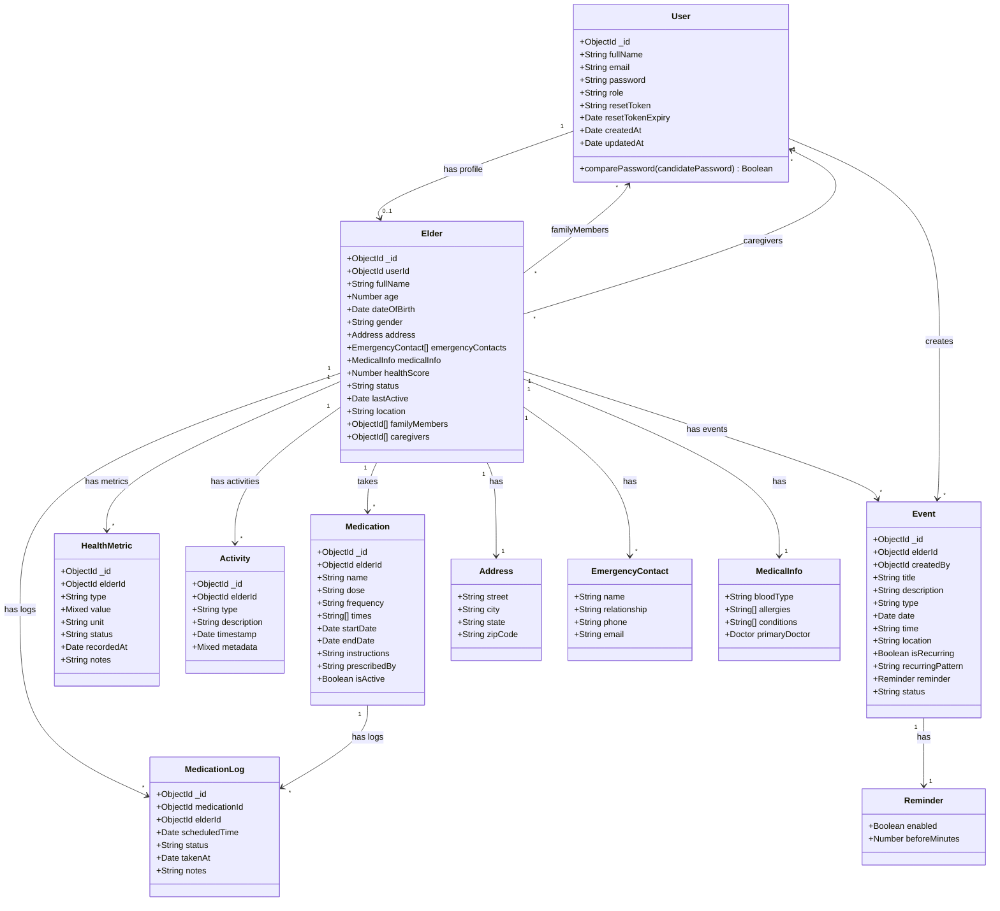

### 3.2 Object Diagram

Object diagram showing sample instances of ALL system entities at runtime.

```
┌─────────────────────────────────────────────────────────────────────────────┐
│                    OBJECT DIAGRAM - System Runtime Snapshot                  │
│                         ElderCare Management System                          │
└─────────────────────────────────────────────────────────────────────────────┘

═══════════════════════════════════════════════════════════════════════════════
                              USER INSTANCES
═══════════════════════════════════════════════════════════════════════════════

┌─────────────────────────────┐    ┌─────────────────────────────┐
│    user1 : User             │    │    user2 : User             │
│    «Elder Account»          │    │    «Family Member Account»  │
├─────────────────────────────┤    ├─────────────────────────────┤
│ _id = "67890abc..."         │    │ _id = "67890def..."         │
│ fullName = "Ahmed Khan"     │    │ fullName = "Sara Khan"      │
│ email = "ahmed@email.com"   │    │ email = "sara@email.com"    │
│ password = "$2a$10$xYz..."  │    │ password = "$2a$10$aBc..."  │
│ role = "elder"              │    │ role = "familyMember"       │
│ resetToken = null           │    │ resetToken = null           │
│ resetTokenExpiry = null     │    │ resetTokenExpiry = null     │
│ createdAt = 2025-12-01      │    │ createdAt = 2025-12-05      │
│ updatedAt = 2026-01-06      │    │ updatedAt = 2026-01-06      │
└─────────────────────────────┘    └─────────────────────────────┘

┌─────────────────────────────┐    ┌─────────────────────────────┐
│    user3 : User             │    │    user4 : User             │
│    «Caregiver Account»      │    │    «Admin Account»          │
├─────────────────────────────┤    ├─────────────────────────────┤
│ _id = "67890ghi..."         │    │ _id = "67890jkl..."         │
│ fullName = "Ali Raza"       │    │ fullName = "Admin User"     │
│ email = "ali@email.com"     │    │ email = "admin@eldercare.com│
│ password = "$2a$10$dEf..."  │    │ password = "$2a$10$gHi..."  │
│ role = "caregiver"          │    │ role = "admin"              │
│ resetToken = null           │    │ resetToken = null           │
│ resetTokenExpiry = null     │    │ resetTokenExpiry = null     │
│ createdAt = 2025-11-15      │    │ createdAt = 2025-01-01      │
│ updatedAt = 2026-01-06      │    │ updatedAt = 2026-01-06      │
└─────────────────────────────┘    └─────────────────────────────┘

═══════════════════════════════════════════════════════════════════════════════
                              ELDER INSTANCE
═══════════════════════════════════════════════════════════════════════════════

┌─────────────────────────────────────────────────────────────────────────────┐
│                           elder1 : Elder                                     │
│                        «Elder Profile Entity»                                │
├─────────────────────────────────────────────────────────────────────────────┤
│ _id = "507f1f77bcf86cd799439012"                                            │
│ userId = "67890abc..." ─────────────────────────────────► user1 : User      │
│ fullName = "Ahmed Khan"                                                      │
│ age = 72                                                                     │
│ dateOfBirth = 1954-03-15                                                    │
│ gender = "male"                                                              │
│                                                                              │
│ address = {                                                                  │
│     street: "123 Main Street",                                              │
│     city: "Karachi",                                                        │
│     state: "Sindh",                                                         │
│     zipCode: "75500"                                                        │
│ }                                                                            │
│                                                                              │
│ emergencyContacts = [                                                        │
│     {                                                                        │
│         name: "Sara Khan",                                                  │
│         relationship: "Daughter",                                           │
│         phone: "+92-300-1234567",                                           │
│         email: "sara@email.com"                                             │
│     },                                                                       │
│     {                                                                        │
│         name: "Bilal Khan",                                                 │
│         relationship: "Son",                                                │
│         phone: "+92-321-7654321",                                           │
│         email: "bilal@email.com"                                            │
│     }                                                                        │
│ ]                                                                            │
│                                                                              │
│ medicalInfo = {                                                              │
│     bloodType: "B+",                                                        │
│     allergies: ["Penicillin", "Peanuts"],                                   │
│     conditions: ["Diabetes Type 2", "Hypertension"],                        │
│     primaryDoctor: {                                                        │
│         name: "Dr. Aisha Malik",                                            │
│         phone: "+92-21-35681234",                                           │
│         hospital: "Aga Khan Hospital"                                       │
│     }                                                                        │
│ }                                                                            │
│                                                                              │
│ healthScore = 78                                                             │
│ status = "active"                                                            │
│ lastActive = 2026-01-06T10:30:00Z                                           │
│ location = "Home"                                                            │
│                                                                              │
│ familyMembers = ["67890def..."] ─────────────────────► user2 : User         │
│ caregivers = ["67890ghi..."] ────────────────────────► user3 : User         │
│                                                                              │
│ createdAt = 2025-12-01T09:00:00Z                                            │
│ updatedAt = 2026-01-06T10:30:00Z                                            │
└─────────────────────────────────────────────────────────────────────────────┘

═══════════════════════════════════════════════════════════════════════════════
                           MEDICATION INSTANCES
═══════════════════════════════════════════════════════════════════════════════

┌─────────────────────────────────────┐    ┌─────────────────────────────────────┐
│      med1 : Medication              │    │      med2 : Medication              │
│      «Active Medication»            │    │      «Active Medication»            │
├─────────────────────────────────────┤    ├─────────────────────────────────────┤
│ _id = "med001..."                   │    │ _id = "med002..."                   │
│ elderId = "507f1f77..." ──► elder1  │    │ elderId = "507f1f77..." ──► elder1  │
│ name = "Metformin"                  │    │ name = "Lisinopril"                 │
│ dose = "500mg"                      │    │ dose = "10mg"                       │
│ frequency = "twice_daily"           │    │ frequency = "once_daily"            │
│ times = ["08:00", "20:00"]          │    │ times = ["09:00"]                   │
│ startDate = 2025-06-01              │    │ startDate = 2025-08-15              │
│ endDate = null                      │    │ endDate = null                      │
│ instructions = "Take with food"    │    │ instructions = "Take on empty      │
│ prescribedBy = "Dr. Aisha Malik"   │    │                  stomach"           │
│ isActive = true                     │    │ prescribedBy = "Dr. Aisha Malik"   │
│ createdAt = 2025-06-01              │    │ isActive = true                     │
│ updatedAt = 2026-01-06              │    │ createdAt = 2025-08-15              │
└─────────────────────────────────────┘    └─────────────────────────────────────┘

┌─────────────────────────────────────┐
│      med3 : Medication              │
│      «Inactive Medication»          │
├─────────────────────────────────────┤
│ _id = "med003..."                   │
│ elderId = "507f1f77..." ──► elder1  │
│ name = "Aspirin"                    │
│ dose = "75mg"                       │
│ frequency = "once_daily"            │
│ times = ["08:00"]                   │
│ startDate = 2025-01-01              │
│ endDate = 2025-11-30                │
│ instructions = "Discontinued"       │
│ prescribedBy = "Dr. Aisha Malik"   │
│ isActive = false                    │
│ createdAt = 2025-01-01              │
│ updatedAt = 2025-11-30              │
└─────────────────────────────────────┘

═══════════════════════════════════════════════════════════════════════════════
                        MEDICATION LOG INSTANCES
═══════════════════════════════════════════════════════════════════════════════

┌───────────────────────────────────┐  ┌───────────────────────────────────┐
│    medLog1 : MedicationLog        │  │    medLog2 : MedicationLog        │
│    «Taken Status»                 │  │    «Pending Status»               │
├───────────────────────────────────┤  ├───────────────────────────────────┤
│ _id = "log001..."                 │  │ _id = "log002..."                 │
│ medicationId = "med001" ─► med1   │  │ medicationId = "med001" ─► med1   │
│ elderId = "507f1f77..." ► elder1  │  │ elderId = "507f1f77..." ► elder1  │
│ scheduledTime = 2026-01-06 08:00  │  │ scheduledTime = 2026-01-06 20:00  │
│ status = "taken"                  │  │ status = "pending"                │
│ takenAt = 2026-01-06 08:15        │  │ takenAt = null                    │
│ notes = "Taken with breakfast"    │  │ notes = null                      │
│ createdAt = 2026-01-06            │  │ createdAt = 2026-01-06            │
└───────────────────────────────────┘  └───────────────────────────────────┘

┌───────────────────────────────────┐  ┌───────────────────────────────────┐
│    medLog3 : MedicationLog        │  │    medLog4 : MedicationLog        │
│    «Missed Status»                │  │    «Skipped Status»               │
├───────────────────────────────────┤  ├───────────────────────────────────┤
│ _id = "log003..."                 │  │ _id = "log004..."                 │
│ medicationId = "med001" ─► med1   │  │ medicationId = "med002" ─► med2   │
│ elderId = "507f1f77..." ► elder1  │  │ elderId = "507f1f77..." ► elder1  │
│ scheduledTime = 2026-01-05 20:00  │  │ scheduledTime = 2026-01-05 09:00  │
│ status = "missed"                 │  │ status = "skipped"                │
│ takenAt = null                    │  │ takenAt = null                    │
│ notes = "Elder was sleeping"      │  │ notes = "Doctor advised skip"     │
│ createdAt = 2026-01-05            │  │ createdAt = 2026-01-05            │
└───────────────────────────────────┘  └───────────────────────────────────┘

═══════════════════════════════════════════════════════════════════════════════
                         HEALTH METRIC INSTANCES
═══════════════════════════════════════════════════════════════════════════════

┌─────────────────────────────────┐  ┌─────────────────────────────────┐
│   metric1 : HealthMetric        │  │   metric2 : HealthMetric        │
│   «Blood Pressure Reading»      │  │   «Heart Rate Reading»          │
├─────────────────────────────────┤  ├─────────────────────────────────┤
│ _id = "hm001..."                │  │ _id = "hm002..."                │
│ elderId = "507f1f77" ─► elder1  │  │ elderId = "507f1f77" ─► elder1  │
│ type = "bloodPressure"          │  │ type = "heartRate"              │
│ value = {                       │  │ value = 72                      │
│     systolic: 128,              │  │ unit = "bpm"                    │
│     diastolic: 82               │  │ status = "normal"               │
│ }                               │  │ recordedAt = 2026-01-06 10:00   │
│ unit = "mmHg"                   │  │ notes = "Resting heart rate"    │
│ status = "normal"               │  │ createdAt = 2026-01-06          │
│ recordedAt = 2026-01-06 10:00   │  └─────────────────────────────────┘
│ notes = "Morning reading"       │
│ createdAt = 2026-01-06          │
└─────────────────────────────────┘

┌─────────────────────────────────┐  ┌─────────────────────────────────┐
│   metric3 : HealthMetric        │  │   metric4 : HealthMetric        │
│   «Blood Glucose Reading»       │  │   «Steps Count»                 │
├─────────────────────────────────┤  ├─────────────────────────────────┤
│ _id = "hm003..."                │  │ _id = "hm004..."                │
│ elderId = "507f1f77" ─► elder1  │  │ elderId = "507f1f77" ─► elder1  │
│ type = "glucose"                │  │ type = "steps"                  │
│ value = 145                     │  │ value = 3250                    │
│ unit = "mg/dL"                  │  │ unit = "steps"                  │
│ status = "high"                 │  │ status = "normal"               │
│ recordedAt = 2026-01-06 07:30   │  │ recordedAt = 2026-01-06 18:00   │
│ notes = "Fasting glucose"       │  │ notes = "Daily step count"      │
│ createdAt = 2026-01-06          │  │ createdAt = 2026-01-06          │
└─────────────────────────────────┘  └─────────────────────────────────┘

┌─────────────────────────────────┐  ┌─────────────────────────────────┐
│   metric5 : HealthMetric        │  │   metric6 : HealthMetric        │
│   «Weight Reading»              │  │   «Sleep Duration»              │
├─────────────────────────────────┤  ├─────────────────────────────────┤
│ _id = "hm005..."                │  │ _id = "hm006..."                │
│ elderId = "507f1f77" ─► elder1  │  │ elderId = "507f1f77" ─► elder1  │
│ type = "weight"                 │  │ type = "sleep"                  │
│ value = 75.5                    │  │ value = 6.5                     │
│ unit = "kg"                     │  │ unit = "hours"                  │
│ status = "normal"               │  │ status = "low"                  │
│ recordedAt = 2026-01-06 07:00   │  │ recordedAt = 2026-01-06 07:00   │
│ notes = "Weekly weigh-in"       │  │ notes = "Less than recommended" │
│ createdAt = 2026-01-06          │  │ createdAt = 2026-01-06          │
└─────────────────────────────────┘  └─────────────────────────────────┘

═══════════════════════════════════════════════════════════════════════════════
                           ACTIVITY INSTANCES
═══════════════════════════════════════════════════════════════════════════════

┌───────────────────────────────────────┐  ┌───────────────────────────────────────┐
│     activity1 : Activity              │  │     activity2 : Activity              │
│     «Medication Activity»             │  │     «Appointment Activity»            │
├───────────────────────────────────────┤  ├───────────────────────────────────────┤
│ _id = "act001..."                     │  │ _id = "act002..."                     │
│ elderId = "507f1f77..." ───► elder1   │  │ elderId = "507f1f77..." ───► elder1   │
│ type = "medication"                   │  │ type = "appointment"                  │
│ description = "Took morning Metformin"│  │ description = "Attended cardio       │
│ timestamp = 2026-01-06T08:15:00Z      │  │               checkup"                │
│ metadata = {                          │  │ timestamp = 2026-01-05T14:00:00Z      │
│     medicationId: "med001",           │  │ metadata = {                          │
│     status: "taken",                  │  │     eventId: "evt002",                │
│     takenBy: "self"                   │  │     doctor: "Dr. Aisha Malik",        │
│ }                                     │  │     location: "Aga Khan Hospital"     │
│ createdAt = 2026-01-06                │  │ }                                     │
└───────────────────────────────────────┘  │ createdAt = 2026-01-05                │
                                           └───────────────────────────────────────┘

┌───────────────────────────────────────┐  ┌───────────────────────────────────────┐
│     activity3 : Activity              │  │     activity4 : Activity              │
│     «Exercise Activity»               │  │     «Emergency Activity»              │
├───────────────────────────────────────┤  ├───────────────────────────────────────┤
│ _id = "act003..."                     │  │ _id = "act004..."                     │
│ elderId = "507f1f77..." ───► elder1   │  │ elderId = "507f1f77..." ───► elder1   │
│ type = "activity"                     │  │ type = "emergency"                    │
│ description = "Morning walk completed"│  │ description = "Fall detected -        │
│ timestamp = 2026-01-06T07:30:00Z      │  │               responded by caregiver" │
│ metadata = {                          │  │ timestamp = 2025-12-20T16:45:00Z      │
│     duration: 30,                     │  │ metadata = {                          │
│     distance: "1.2km",                │  │     alertType: "fall",                │
│     steps: 1500                       │  │     respondedBy: "67890ghi...",       │
│ }                                     │  │     responseTime: "5 minutes",        │
│ createdAt = 2026-01-06                │  │     outcome: "No injury"              │
└───────────────────────────────────────┘  │ }                                     │
                                           │ createdAt = 2025-12-20                │
                                           └───────────────────────────────────────┘

┌───────────────────────────────────────┐  ┌───────────────────────────────────────┐
│     activity5 : Activity              │  │     activity6 : Activity              │
│     «Communication Activity»          │  │     «Reminder Activity»               │
├───────────────────────────────────────┤  ├───────────────────────────────────────┤
│ _id = "act005..."                     │  │ _id = "act006..."                     │
│ elderId = "507f1f77..." ───► elder1   │  │ elderId = "507f1f77..." ───► elder1   │
│ type = "communication"                │  │ type = "reminder"                     │
│ description = "Video call with        │  │ description = "Hydration reminder     │
│               daughter Sara"          │  │               acknowledged"           │
│ timestamp = 2026-01-05T19:00:00Z      │  │ timestamp = 2026-01-06T12:00:00Z      │
│ metadata = {                          │  │ metadata = {                          │
│     callDuration: 25,                 │  │     reminderType: "hydration",        │
│     participants: ["67890def..."],    │  │     response: "acknowledged",         │
│     callType: "video"                 │  │     waterIntake: "200ml"              │
│ }                                     │  │ }                                     │
│ createdAt = 2026-01-05                │  │ createdAt = 2026-01-06                │
└───────────────────────────────────────┘  └───────────────────────────────────────┘

═══════════════════════════════════════════════════════════════════════════════
                             EVENT INSTANCES
═══════════════════════════════════════════════════════════════════════════════

┌─────────────────────────────────────────┐  ┌─────────────────────────────────────────┐
│       event1 : Event                    │  │       event2 : Event                    │
│       «Medical Appointment»             │  │       «Therapy Session»                 │
├─────────────────────────────────────────┤  ├─────────────────────────────────────────┤
│ _id = "evt001..."                       │  │ _id = "evt002..."                       │
│ elderId = "507f1f77..." ────► elder1    │  │ elderId = "507f1f77..." ────► elder1    │
│ createdBy = "67890def..." ──► user2     │  │ createdBy = "67890ghi..." ──► user3     │
│ title = "Cardiology Checkup"            │  │ title = "Physiotherapy Session"         │
│ description = "Quarterly heart checkup" │  │ description = "Weekly knee therapy"     │
│ type = "medical"                        │  │ type = "therapy"                        │
│ date = 2026-01-15                       │  │ date = 2026-01-08                       │
│ time = "10:00 AM"                       │  │ time = "11:00 AM"                       │
│ location = "Aga Khan Hospital"          │  │ location = "PhysioCare Center"          │
│ isRecurring = false                     │  │ isRecurring = true                      │
│ recurringPattern = null                 │  │ recurringPattern = "weekly"             │
│ reminder = {                            │  │ reminder = {                            │
│     enabled: true,                      │  │     enabled: true,                      │
│     beforeMinutes: 60                   │  │     beforeMinutes: 30                   │
│ }                                       │  │ }                                       │
│ status = "scheduled"                    │  │ status = "scheduled"                    │
│ createdAt = 2026-01-01                  │  │ createdAt = 2025-12-15                  │
│ updatedAt = 2026-01-06                  │  │ updatedAt = 2026-01-06                  │
└─────────────────────────────────────────┘  └─────────────────────────────────────────┘

┌─────────────────────────────────────────┐  ┌─────────────────────────────────────────┐
│       event3 : Event                    │  │       event4 : Event                    │
│       «Social Event»                    │  │       «Completed Appointment»           │
├─────────────────────────────────────────┤  ├─────────────────────────────────────────┤
│ _id = "evt003..."                       │  │ _id = "evt004..."                       │
│ elderId = "507f1f77..." ────► elder1    │  │ elderId = "507f1f77..." ────► elder1    │
│ createdBy = "67890def..." ──► user2     │  │ createdBy = "67890def..." ──► user2     │
│ title = "Family Dinner"                 │  │ title = "Eye Checkup"                   │
│ description = "Monthly family gathering"│  │ description = "Annual vision test"      │
│ type = "social"                         │  │ type = "medical"                        │
│ date = 2026-01-20                       │  │ date = 2026-01-02                       │
│ time = "07:00 PM"                       │  │ time = "02:00 PM"                       │
│ location = "Home"                       │  │ location = "Eye Care Clinic"            │
│ isRecurring = true                      │  │ isRecurring = false                     │
│ recurringPattern = "monthly"            │  │ recurringPattern = null                 │
│ reminder = {                            │  │ reminder = {                            │
│     enabled: true,                      │  │     enabled: true,                      │
│     beforeMinutes: 120                  │  │     beforeMinutes: 60                   │
│ }                                       │  │ }                                       │
│ status = "scheduled"                    │  │ status = "completed"                    │
│ createdAt = 2025-12-01                  │  │ createdAt = 2025-12-20                  │
│ updatedAt = 2026-01-06                  │  │ updatedAt = 2026-01-02                  │
└─────────────────────────────────────────┘  └─────────────────────────────────────────┘

┌─────────────────────────────────────────┐
│       event5 : Event                    │
│       «Cancelled Event»                 │
├─────────────────────────────────────────┤
│ _id = "evt005..."                       │
│ elderId = "507f1f77..." ────► elder1    │
│ createdBy = "67890ghi..." ──► user3     │
│ title = "Dental Cleaning"               │
│ description = "Routine dental checkup"  │
│ type = "medical"                        │
│ date = 2026-01-03                       │
│ time = "03:00 PM"                       │
│ location = "Dental Care Clinic"         │
│ isRecurring = false                     │
│ recurringPattern = null                 │
│ reminder = {                            │
│     enabled: false,                     │
│     beforeMinutes: 30                   │
│ }                                       │
│ status = "cancelled"                    │
│ createdAt = 2025-12-25                  │
│ updatedAt = 2026-01-02                  │
└─────────────────────────────────────────┘

═══════════════════════════════════════════════════════════════════════════════
                        OBJECT RELATIONSHIPS SUMMARY
═══════════════════════════════════════════════════════════════════════════════

                                    ┌─────────────┐
                                    │   user4     │
                                    │   (Admin)   │
                                    └─────────────┘
                                           │
                                    manages all users
                                           │
    ┌──────────────────────────────────────┼──────────────────────────────────────┐
    │                                      │                                      │
    ▼                                      ▼                                      ▼
┌─────────┐                          ┌─────────┐                          ┌─────────┐
│  user1  │                          │  user2  │                          │  user3  │
│ (Elder) │                          │(Family) │                          │(Volunt.)│
└────┬────┘                          └────┬────┘                          └────┬────┘
     │                                    │                                    │
     │ has profile                        │ monitors                           │ cares for
     ▼                                    │                                    │
┌─────────────────────────────────────────┴────────────────────────────────────┘
│                                    elder1                                     │
└──────┬─────────────┬─────────────────┬────────────────┬────────────────┬─────┘
       │             │                 │                │                │
       ▼             ▼                 ▼                ▼                ▼
   ┌───────┐    ┌────────┐       ┌──────────┐    ┌──────────┐    ┌──────────┐
   │ med1  │    │ med2   │       │ metric1  │    │activity1 │    │ event1   │
   │ med2  │    │ med3   │       │ metric2  │    │activity2 │    │ event2   │
   │ med3  │    └────┬───┘       │ metric3  │    │activity3 │    │ event3   │
   └───┬───┘         │           │ metric4  │    │activity4 │    │ event4   │
       │             │           │ metric5  │    │activity5 │    │ event5   │
       ▼             │           │ metric6  │    │activity6 │    └──────────┘
   ┌────────┐        │           └──────────┘    └──────────┘
   │medLog1 │◄───────┘
   │medLog2 │
   │medLog3 │
   │medLog4 │
   └────────┘

═══════════════════════════════════════════════════════════════════════════════
                              INSTANCE COUNT SUMMARY
═══════════════════════════════════════════════════════════════════════════════

┌────────────────────┬───────────┬─────────────────────────────────────────────┐
│ Entity             │ Instances │ Description                                 │
├────────────────────┼───────────┼─────────────────────────────────────────────┤
│ User               │     4     │ Elder, Family, Caregiver, Admin             │
│ Elder              │     1     │ Ahmed Khan's profile                        │
│ Medication         │     3     │ 2 active, 1 inactive                        │
│ MedicationLog      │     4     │ taken, pending, missed, skipped             │
│ HealthMetric       │     6     │ BP, HR, glucose, steps, weight, sleep       │
│ Activity           │     6     │ medication, appointment, activity,          │
│                    │           │ emergency, communication, reminder          │
│ Event              │     5     │ 3 scheduled, 1 completed, 1 cancelled       │
├────────────────────┼───────────┼─────────────────────────────────────────────┤
│ TOTAL              │    29     │ Complete system snapshot                    │
└────────────────────┴───────────┴─────────────────────────────────────────────┘
```

### 3.3 Package Diagram

Shows the organization of system modules and their dependencies.

```mermaid
flowchart TB
    subgraph Frontend["📦 Frontend Package (eldercare/)"]
        subgraph Pages["📁 Pages"]
            HP[HomePage]
            SI[SignIn]
            SU[SignUp]
            FP[ForgetPassword]
            RP[ResetPassword]
        end
        subgraph Dashboards["📁 Dashboards"]
            ED[ElderDashboard]
            FD[FamilyDashboard]
            AD[AdminDashboard]
            VD[VolunteerDashboard]
        end
        subgraph Components["📁 Components"]
            SB[Sidebar]
            CD[Card]
        end
        subgraph Config["📁 Configuration"]
            APP[App.js]
            RW[RouterWrapper]
        end
    end

    subgraph Backend["📦 Backend Package (backend/)"]
        subgraph Routes["📁 Routes"]
            AR[authRoutes]
            FR[familyRoutes]
            ADR[adminRoutes]
            VR[volunteerRoutes]
        end
        subgraph Controllers["📁 Controllers"]
            AC[authController]
            FC[familyController]
            ADC[adminController]
            VC[volunteerController]
        end
        subgraph Models["📁 Models"]
            UM[User]
            EM[Elder]
            MM[Medication]
            HM[HealthMetric]
            AM[Activity]
            EVM[Event]
        end
        subgraph Middleware["📁 Middleware"]
            AUTH[auth.js]
        end
        SRV[server.js]
    end

    subgraph External["📦 External Packages"]
        REACT[React]
        MUI[Material UI]
        AXIOS[Axios]
        EXPRESS[Express]
        MONGOOSE[Mongoose]
        JWT[jsonwebtoken]
        BCRYPT[bcryptjs]
    end

    Frontend --> REACT
    Frontend --> MUI
    Frontend --> AXIOS
    Backend --> EXPRESS
    Backend --> MONGOOSE
    Backend --> JWT
    Backend --> BCRYPT

    Pages --> APP
    Dashboards --> APP
    Components --> Dashboards
    
    Routes --> SRV
    Routes --> Controllers
    Controllers --> Models
    Middleware --> Routes
```

### 3.4 Deployment Diagram

Shows the physical deployment of system components.

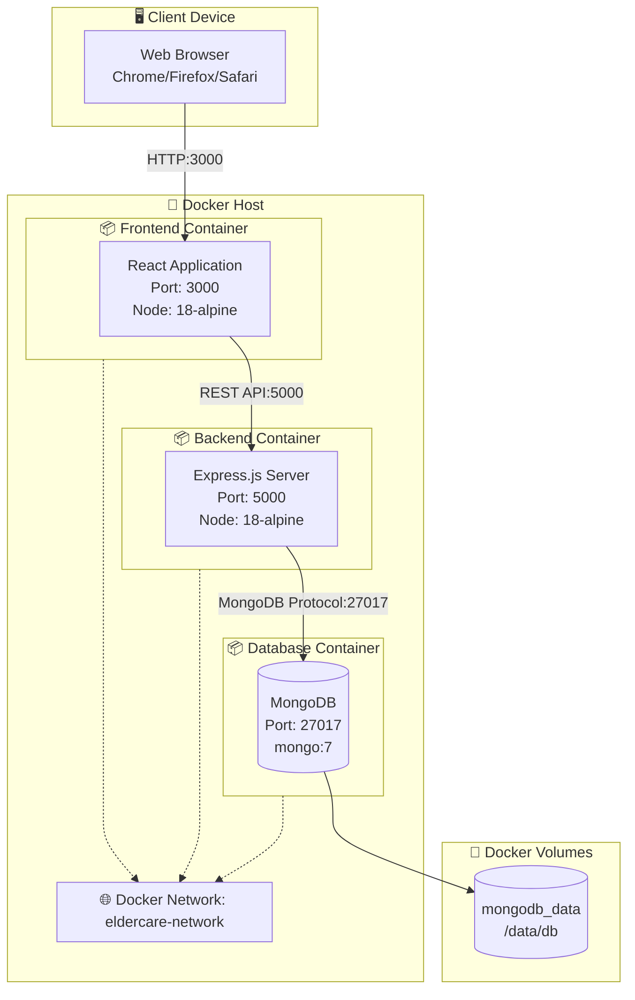

### 3.5 Profile Diagram

Shows stereotypes and constraints applied to model elements.

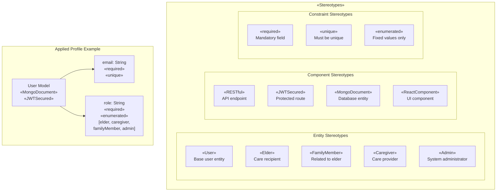

---

## 4. Behaviour Diagrams

Behaviour diagrams show the dynamic behavior of the system.

### 4.1 Use Case Diagram

Shows all actors and their interactions with the system.

```mermaid
flowchart TB
    subgraph Actors
        Elder((👴 Elder))
        Family((👨‍👩‍👧 Family<br/>Member))
        Volunteer((🤝 Volunteer/<br/>Caregiver))
        Admin((👨‍💼 Admin))
        Guest((👤 Guest))
    end

    subgraph ElderCareSystem["ElderCare Management System"]
        subgraph AuthModule["Authentication Module"]
            UC1[Sign Up]
            UC2[Sign In]
            UC3[Forgot Password]
            UC4[Reset Password]
            UC5[View Profile]
        end

        subgraph ElderModule["Elder Module"]
            UC6[View Dashboard]
            UC7[View Health Metrics]
            UC8[View Medications]
            UC9[View Schedule/Events]
            UC10[View Activities]
            UC11[Emergency Alert]
        end

        subgraph FamilyModule["Family Module"]
            UC12[Monitor Elder]
            UC13[View Elder Health]
            UC14[Schedule Appointment]
            UC15[View Medication Schedule]
            UC16[Send Message]
        end

        subgraph VolunteerModule["Volunteer Module"]
            UC17[View Assigned Elders]
            UC18[View Today's Tasks]
            UC19[Complete Task]
            UC20[Log Activity]
            UC21[Update Availability]
        end

        subgraph AdminModule["Admin Module"]
            UC22[Manage Users]
            UC23[View Dashboard Stats]
            UC24[Delete User]
            UC25[View All Elders]
            UC26[System Health Check]
        end
    end

    Guest --> UC1
    Guest --> UC2
    Guest --> UC3
    Guest --> UC4

    Elder --> UC5
    Elder --> UC6
    Elder --> UC7
    Elder --> UC8
    Elder --> UC9
    Elder --> UC10
    Elder --> UC11

    Family --> UC5
    Family --> UC12
    Family --> UC13
    Family --> UC14
    Family --> UC15
    Family --> UC16

    Volunteer --> UC5
    Volunteer --> UC17
    Volunteer --> UC18
    Volunteer --> UC19
    Volunteer --> UC20
    Volunteer --> UC21

    Admin --> UC5
    Admin --> UC22
    Admin --> UC23
    Admin --> UC24
    Admin --> UC25
    Admin --> UC26
```

### 4.2 Activity Diagram - User Authentication Flow

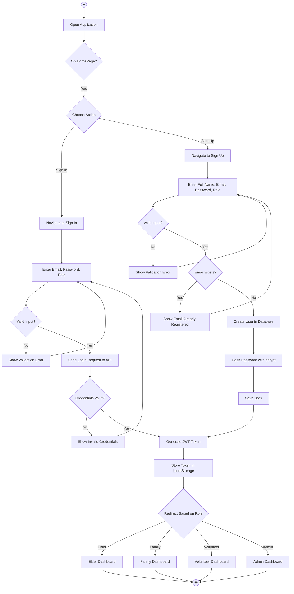

### 4.3 Activity Diagram - Password Reset Flow

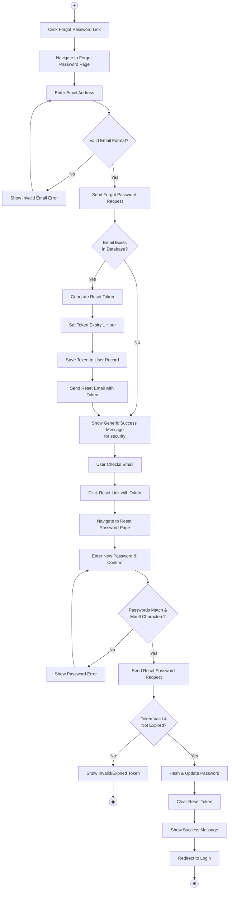

### 4.4 Activity Diagram - Family Member Monitoring Elder

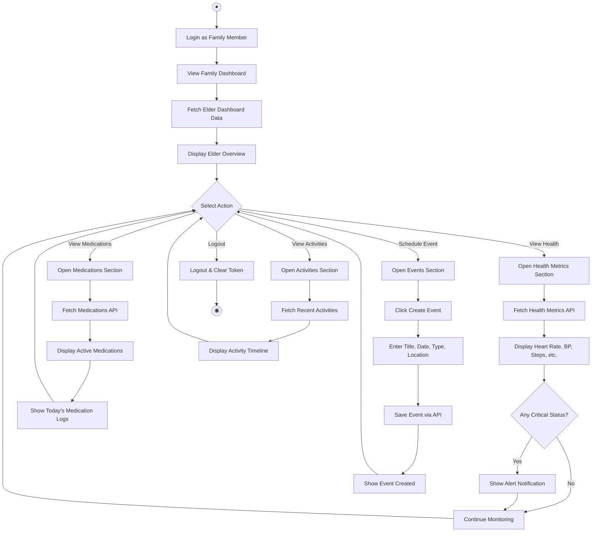

### 4.5 State Machine Diagram - Elder Status

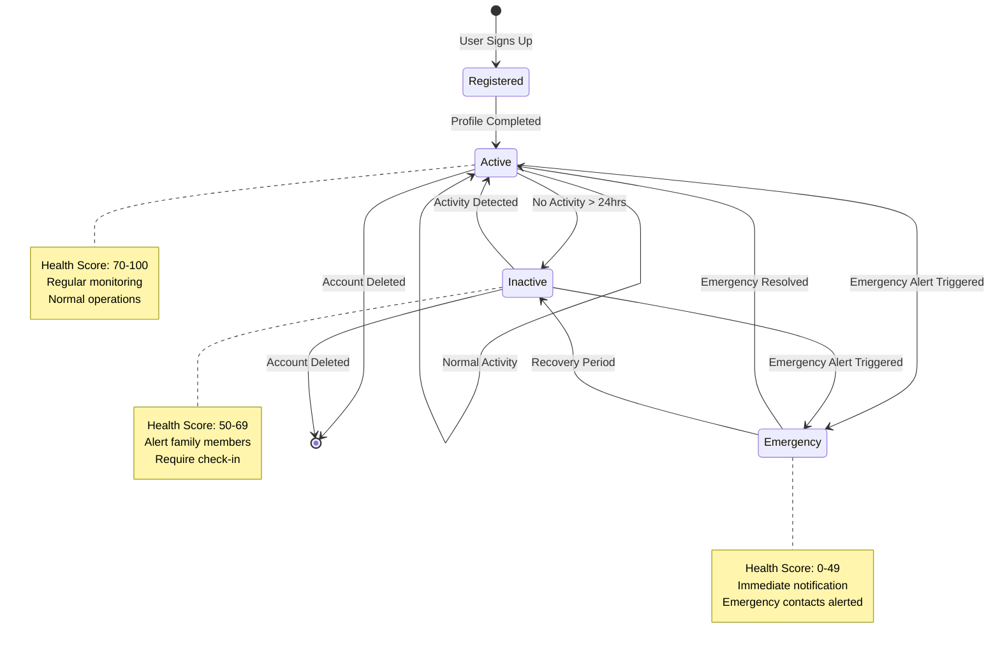

### 4.6 State Machine Diagram - Medication Log Status

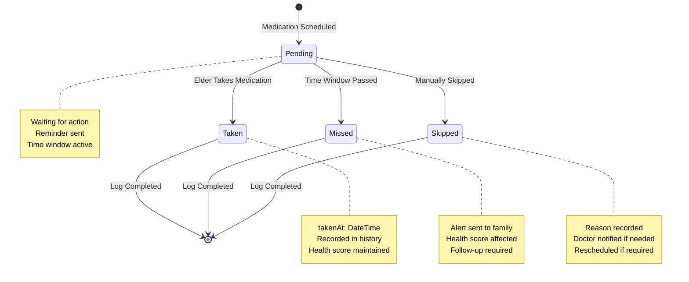

### 4.7 State Machine Diagram - Event Status

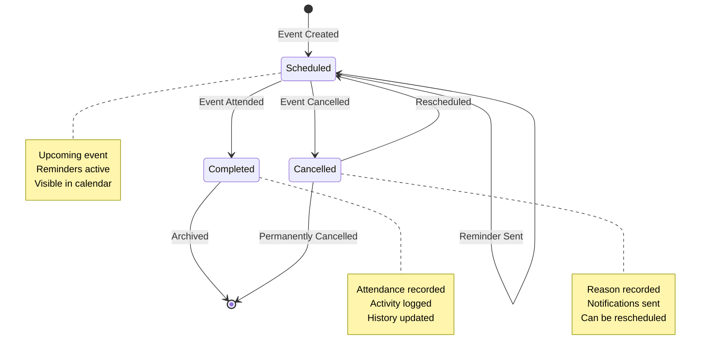

---

## 5. Interaction Diagrams

Interaction diagrams show how objects interact with each other.

### 5.1 Sequence Diagram - User Sign In

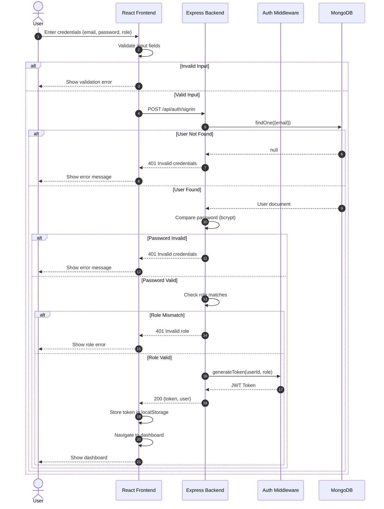

### 5.2 Sequence Diagram - Password Reset

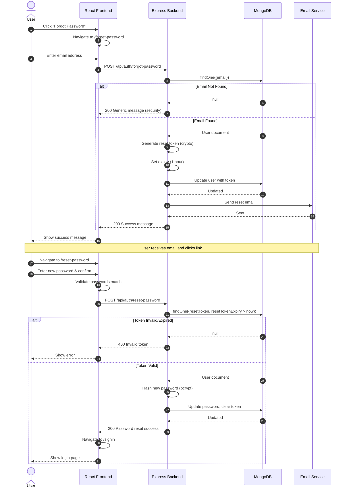

### 5.3 Sequence Diagram - Family Member Views Elder Health

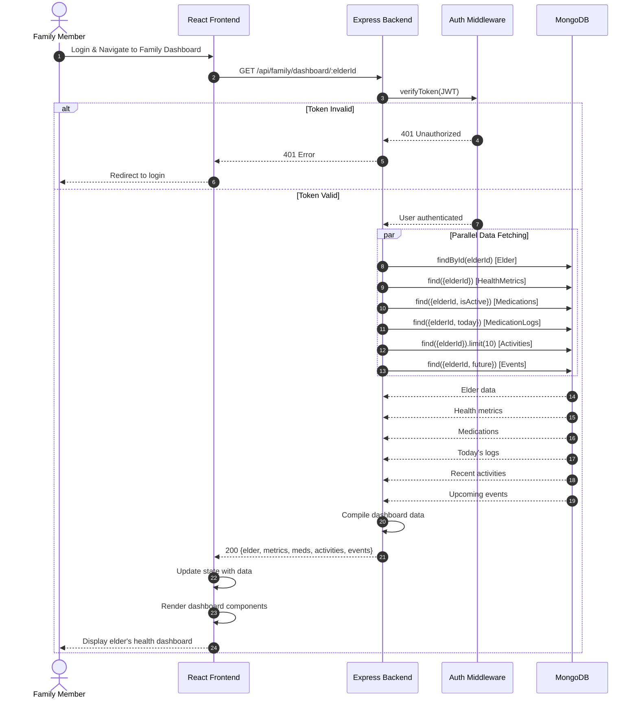

### 5.4 Sequence Diagram - Volunteer Completes Task

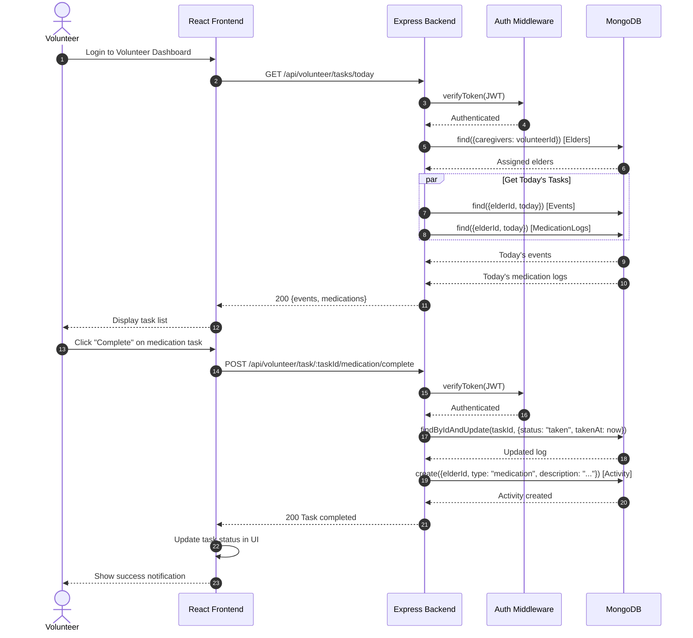

### 5.5 Communication Diagram - User Registration

```
┌─────────────────────────────────────────────────────────────────────────────┐
│                    Communication Diagram: User Registration                  │
└─────────────────────────────────────────────────────────────────────────────┘

                         1: enterDetails()
              ┌──────────────────────────────────┐
              │                                  ▼
         ┌────────┐                        ┌──────────┐
         │  User  │                        │  SignUp  │
         │(Actor) │                        │   Page   │
         └────────┘                        └──────────┘
              ▲                                  │
              │                                  │ 2: validateInput()
              │ 8: showSuccess()                 │
              │                                  ▼
              │                            ┌──────────┐
              │                            │  Axios   │
              │                            │  Client  │
              │                            └──────────┘
              │                                  │
              │                                  │ 3: POST /api/auth/signup
              │                                  ▼
              │                            ┌──────────┐
              │                            │  Auth    │
              │                            │Controller│
              │                            └──────────┘
              │                                  │
              │                    ┌─────────────┼─────────────┐
              │                    │             │             │
              │          4: findOne│    5: save  │   6: hash   │
              │                    ▼             ▼             ▼
              │               ┌────────┐   ┌────────┐   ┌────────┐
              │               │  User  │   │  User  │   │ Bcrypt │
              │               │ Model  │   │ Model  │   │        │
              │               └────────┘   └────────┘   └────────┘
              │                    │             │
              │                    └──────┬──────┘
              │                           │
              │                           │ 7: generateToken()
              │                           ▼
              │                     ┌──────────┐
              └─────────────────────│   JWT    │
                                    │  Module  │
                                    └──────────┘

Message Sequence:
─────────────────
1: User enters registration details (fullName, email, password, role)
2: SignUp page validates input fields
3: Axios sends POST request to /api/auth/signup
4: AuthController checks if email exists in database
5: If not exists, save new user to database
6: Before save, bcrypt hashes the password
7: Generate JWT token for the new user
8: Return success response and redirect user
```

### 5.6 Communication Diagram - Health Metric Recording

```
┌─────────────────────────────────────────────────────────────────────────────┐
│                Communication Diagram: Record Health Metric                   │
└─────────────────────────────────────────────────────────────────────────────┘

                      1: recordMetric()
           ┌────────────────────────────────────┐
           │                                    ▼
      ┌─────────┐                         ┌──────────┐
      │  Elder  │                         │Dashboard │
      │ (Actor) │                         │   UI     │
      └─────────┘                         └──────────┘
           ▲                                    │
           │                                    │ 2: POST /api/health
           │ 9: displayConfirmation()           │
           │                                    ▼
           │                              ┌──────────┐
           │                              │   API    │
           │                              │  Server  │
           │                              └──────────┘
           │                                    │
           │                   ┌────────────────┼────────────────┐
           │                   │                │                │
           │        3: verify  │     4: save    │   5: evaluate  │
           │                   ▼                ▼                ▼
           │             ┌──────────┐    ┌──────────┐    ┌──────────┐
           │             │   Auth   │    │ Health   │    │  Status  │
           │             │Middleware│    │ Metric   │    │Evaluator │
           │             └──────────┘    │  Model   │    └──────────┘
           │                             └──────────┘           │
           │                                   ▲                │
           │                                   │ 6: setStatus   │
           │                                   └────────────────┘
           │                                   │
           │                   ┌───────────────┤
           │                   │               │
           │        7: update  │    8: log     │
           │                   ▼               ▼
           │             ┌──────────┐    ┌──────────┐
           └─────────────│  Elder   │    │ Activity │
                         │  Model   │    │  Model   │
                         └──────────┘    └──────────┘

Message Sequence:
─────────────────
1: Elder records health metric (type, value, unit)
2: Dashboard sends POST request to API
3: Auth middleware verifies JWT token
4: Save health metric to database
5: Evaluate if value is normal/low/high/critical
6: Set status based on evaluation
7: Update elder's health score if needed
8: Log activity for tracking
9: Display confirmation to elder
```

---

## 6. Data Design

### 6.1 Entity Relationship Diagram (ERD)

```
┌─────────────────────────────────────────────────────────────────────────────┐
│                        Entity Relationship Diagram                           │
└─────────────────────────────────────────────────────────────────────────────┘

┌─────────────────┐         ┌─────────────────┐         ┌─────────────────┐
│      USER       │         │      ELDER      │         │   MEDICATION    │
├─────────────────┤         ├─────────────────┤         ├─────────────────┤
│ PK _id          │────┐    │ PK _id          │────┬────│ PK _id          │
│    fullName     │    │    │ FK userId       │    │    │ FK elderId      │
│    email        │    └───►│    fullName     │    │    │    name         │
│    password     │         │    age          │    │    │    dose         │
│    role         │◄───────┐│    dateOfBirth  │    │    │    frequency    │
│    resetToken   │    │   ││    gender       │    │    │    times[]      │
│    resetExpiry  │    │   ││    address{}    │    │    │    startDate    │
│    createdAt    │    │   ││    emergency[]  │    │    │    endDate      │
│    updatedAt    │    │   ││    medicalInfo{}│    │    │    instructions │
└─────────────────┘    │   ││    healthScore  │    │    │    prescribedBy │
                       │   ││    status       │    │    │    isActive     │
                       │   ││    lastActive   │    │    └─────────────────┘
                       │   ││    location     │    │              │
                       │   │└─────────────────┘    │              │
                       │   │         │             │              │
                       │   │         │ 1:N         │              │ 1:N
                       │   │         ▼             │              ▼
                       │   │ ┌─────────────────┐   │    ┌─────────────────┐
                       │   │ │  HEALTH_METRIC  │   │    │ MEDICATION_LOG  │
                       │   │ ├─────────────────┤   │    ├─────────────────┤
                       │   │ │ PK _id          │   │    │ PK _id          │
                       │   │ │ FK elderId      │   │    │ FK medicationId │
                       │   │ │    type         │   │    │ FK elderId      │
                       │   │ │    value        │   │    │    scheduledTime│
                       │   │ │    unit         │   │    │    status       │
                       │   │ │    status       │   │    │    takenAt      │
                       │   │ │    recordedAt   │   │    │    notes        │
                       │   │ │    notes        │   │    └─────────────────┘
                       │   │ └─────────────────┘   │
                       │   │         │             │
    N:M familyMembers  │   │         │ 1:N         │
    ───────────────────┘   │         ▼             │
                           │ ┌─────────────────┐   │
    N:M caregivers         │ │    ACTIVITY     │   │
    ───────────────────────┘ ├─────────────────┤   │
                             │ PK _id          │   │
                             │ FK elderId      │   │
                             │    type         │   │
                             │    description  │   │
                             │    timestamp    │   │
                             │    metadata{}   │   │
                             └─────────────────┘   │
                                                   │
                             ┌─────────────────┐   │
                             │      EVENT      │   │
                             ├─────────────────┤   │
                             │ PK _id          │◄──┘
                             │ FK elderId      │
                             │ FK createdBy    │◄──── USER
                             │    title        │
                             │    description  │
                             │    type         │
                             │    date         │
                             │    time         │
                             │    location     │
                             │    isRecurring  │
                             │    pattern      │
                             │    reminder{}   │
                             │    status       │
                             └─────────────────┘

Relationships:
──────────────
USER ──────1:1────── ELDER (userId reference)
USER ──────N:M────── ELDER (familyMembers array)
USER ──────N:M────── ELDER (caregivers array)
ELDER ─────1:N────── MEDICATION
ELDER ─────1:N────── HEALTH_METRIC
ELDER ─────1:N────── ACTIVITY
ELDER ─────1:N────── EVENT
MEDICATION ─1:N───── MEDICATION_LOG
USER ──────1:N────── EVENT (createdBy)
```

### 6.2 Database Schema Details

#### Users Collection
```javascript
{
  _id: ObjectId,
  fullName: String (required),
  email: String (required, unique, lowercase),
  password: String (required, min: 6, hashed),
  role: String (enum: ["elder", "caregiver", "familyMember", "admin"]),
  resetToken: String (nullable),
  resetTokenExpiry: Date (nullable),
  createdAt: Date,
  updatedAt: Date
}
```

#### Elders Collection
```javascript
{
  _id: ObjectId,
  userId: ObjectId (ref: User),
  fullName: String (required),
  age: Number (required),
  dateOfBirth: Date,
  gender: String (enum: ["male", "female", "other"]),
  address: {
    street: String,
    city: String,
    state: String,
    zipCode: String
  },
  emergencyContacts: [{
    name: String,
    relationship: String,
    phone: String,
    email: String
  }],
  medicalInfo: {
    bloodType: String,
    allergies: [String],
    conditions: [String],
    primaryDoctor: {
      name: String,
      phone: String,
      hospital: String
    }
  },
  healthScore: Number (default: 80, min: 0, max: 100),
  status: String (enum: ["active", "inactive", "emergency"]),
  lastActive: Date,
  location: String (default: "Home"),
  familyMembers: [ObjectId] (ref: User),
  caregivers: [ObjectId] (ref: User),
  createdAt: Date,
  updatedAt: Date
}
```

### 6.3 Indexes

| Collection | Index | Type | Purpose |
|------------|-------|------|---------|
| users | email | Unique | Fast login lookup |
| users | resetToken | Sparse | Password reset |
| elders | userId | Single | User profile lookup |
| elders | familyMembers | Multi | Family queries |
| elders | caregivers | Multi | Volunteer queries |
| healthMetrics | elderId, recordedAt | Compound | Time-series queries |
| medications | elderId, isActive | Compound | Active meds lookup |
| events | elderId, date | Compound | Calendar queries |
| activities | elderId, timestamp | Compound | Activity timeline |

---

## 7. Interface Design

### 7.1 API Endpoints

#### Authentication API (`/api/auth`)

| Method | Endpoint | Description | Auth Required |
|--------|----------|-------------|---------------|
| POST | `/signup` | Register new user | No |
| POST | `/signin` | Login user | No |
| POST | `/forgot-password` | Request password reset | No |
| POST | `/reset-password` | Reset password with token | No |
| GET | `/profile` | Get current user profile | Yes |

#### Family API (`/api/family`)

| Method | Endpoint | Description | Auth Required |
|--------|----------|-------------|---------------|
| GET | `/elder/:elderId` | Get elder details | Yes |
| GET | `/elder/:elderId/health` | Get health metrics | Yes |
| GET | `/elder/:elderId/medications` | Get medications | Yes |
| GET | `/elder/:elderId/activities` | Get recent activities | Yes |
| GET | `/elder/:elderId/events` | Get upcoming events | Yes |
| POST | `/elder/:elderId/events` | Create new event | Yes |
| GET | `/dashboard/:elderId` | Get full dashboard data | Yes |

#### Admin API (`/api/admin`)

| Method | Endpoint | Description | Auth Required |
|--------|----------|-------------|---------------|
| GET | `/users` | Get all users (paginated) | Yes (Admin) |
| GET | `/stats` | Get dashboard statistics | Yes (Admin) |
| PUT | `/users/:userId/status` | Update user status | Yes (Admin) |
| DELETE | `/users/:userId` | Delete user | Yes (Admin) |
| GET | `/elders` | Get all elders | Yes (Admin) |
| GET | `/system/health` | Get system health status | Yes (Admin) |

#### Volunteer API (`/api/volunteer`)

| Method | Endpoint | Description | Auth Required |
|--------|----------|-------------|---------------|
| GET | `/elders` | Get assigned elders | Yes |
| GET | `/tasks/today` | Get today's tasks | Yes |
| GET | `/stats` | Get volunteer statistics | Yes |
| POST | `/activity` | Log activity | Yes |
| PUT | `/availability` | Update availability | Yes |
| POST | `/task/:taskId/:taskType/complete` | Complete a task | Yes |

### 7.2 Request/Response Examples

#### Sign In Request
```json
POST /api/auth/signin
{
  "email": "ahmed@email.com",
  "password": "securepass123",
  "role": "elder"
}
```

#### Sign In Response
```json
{
  "message": "Login successful.",
  "token": "eyJhbGciOiJIUzI1NiIsInR5cCI6IkpXVCJ9...",
  "user": {
    "id": "507f1f77bcf86cd799439011",
    "fullName": "Ahmed Khan",
    "email": "ahmed@email.com",
    "role": "elder"
  }
}
```

### 7.3 UI Component Hierarchy

```
App
├── HomePage
│   ├── Header
│   ├── HeroSection
│   ├── ServicesSection
│   └── Footer
│
├── SignIn
│   ├── RoleSelector
│   ├── EmailField
│   ├── PasswordField
│   └── SubmitButton
│
├── SignUp
│   ├── FullNameField
│   ├── EmailField
│   ├── PasswordField
│   ├── RoleSelector
│   └── SubmitButton
│
├── ElderDashboard
│   ├── Sidebar
│   ├── HealthOverview
│   │   ├── HealthScoreCard
│   │   └── MetricsGrid
│   ├── MedicationReminders
│   ├── UpcomingEvents
│   └── ActivityTimeline
│
├── FamilyDashboard
│   ├── Sidebar
│   ├── ElderStatusCard
│   ├── HealthMetricsPanel
│   ├── MedicationTracker
│   └── EventScheduler
│
├── AdminDashboard
│   ├── Sidebar
│   ├── StatsCards
│   ├── UserManagement
│   └── SystemHealth
│
└── VolunteerDashboard
    ├── Sidebar
    ├── AssignedElders
    ├── TodaysTasks
    └── ActivityLog
```

---

## 8. References

### 8.1 Technologies Used

| Technology | Version | Documentation |
|------------|---------|---------------|
| React | 18.x | https://react.dev |
| Material UI | 7.x | https://mui.com |
| React Router | 6.x | https://reactrouter.com |
| Node.js | 18.x | https://nodejs.org |
| Express | 5.x | https://expressjs.com |
| MongoDB | 7.x | https://mongodb.com |
| Mongoose | 9.x | https://mongoosejs.com |
| JWT | - | https://jwt.io |
| Docker | - | https://docker.com |

### 8.2 UML Standards

- UML 2.5.1 Specification - Object Management Group (OMG)
- ISO/IEC 19501:2005 - Unified Modeling Language

### 8.3 Design Patterns Used

| Pattern | Usage |
|---------|-------|
| **MVC** | Backend architecture (Models, Controllers, Routes) |
| **Repository** | Database access through Mongoose models |
| **Middleware** | Authentication and request processing |
| **Component** | React UI components |
| **Observer** | React state management (useState, useEffect) |

---

## 9. Additional UML Diagrams (Optional)

These diagrams provide additional perspectives on the system design.

### 9.1 Component Diagram

Shows the high-level components and their dependencies.

```
┌─────────────────────────────────────────────────────────────────────────────┐
│                            Component Diagram                                 │
└─────────────────────────────────────────────────────────────────────────────┘

┌─────────────────────────────────────────────────────────────────────────────┐
│                        «subsystem» ElderCare System                          │
│                                                                              │
│  ┌──────────────────────────────────────────────────────────────────────┐  │
│  │                    «subsystem» Presentation Layer                      │  │
│  │                                                                        │  │
│  │   ┌─────────────┐  ┌─────────────┐  ┌─────────────┐  ┌─────────────┐ │  │
│  │   │  «component»│  │  «component»│  │  «component»│  │  «component»│ │  │
│  │   │   HomePage  │  │   SignIn    │  │   SignUp    │  │  Dashboard  │ │  │
│  │   │             │  │             │  │             │  │  Components │ │  │
│  │   └──────┬──────┘  └──────┬──────┘  └──────┬──────┘  └──────┬──────┘ │  │
│  │          │                │                │                │        │  │
│  │          └────────────────┴────────────────┴────────────────┘        │  │
│  │                                    │                                  │  │
│  │                          ┌─────────┴─────────┐                       │  │
│  │                          │    «component»    │                       │  │
│  │                          │   Router/App.js   │                       │  │
│  │                          └─────────┬─────────┘                       │  │
│  └──────────────────────────────────────────────────────────────────────┘  │
│                                       │                                     │
│                              «interface»                                    │
│                              IHttpClient                                    │
│                                       │                                     │
│  ┌──────────────────────────────────────────────────────────────────────┐  │
│  │                    «subsystem» Business Logic Layer                    │  │
│  │                                                                        │  │
│  │   ┌─────────────┐  ┌─────────────┐  ┌─────────────┐  ┌─────────────┐ │  │
│  │   │  «component»│  │  «component»│  │  «component»│  │  «component»│ │  │
│  │   │    Auth     │  │   Family    │  │    Admin    │  │  Volunteer  │ │  │
│  │   │  Controller │  │  Controller │  │  Controller │  │  Controller │ │  │
│  │   └──────┬──────┘  └──────┬──────┘  └──────┬──────┘  └──────┬──────┘ │  │
│  │          │                │                │                │        │  │
│  │          └────────────────┴────────────────┴────────────────┘        │  │
│  │                                    │                                  │  │
│  │                          ┌─────────┴─────────┐                       │  │
│  │                          │    «component»    │                       │  │
│  │                          │  Auth Middleware  │                       │  │
│  │                          └─────────┬─────────┘                       │  │
│  └──────────────────────────────────────────────────────────────────────┘  │
│                                       │                                     │
│                              «interface»                                    │
│                              IDataAccess                                    │
│                                       │                                     │
│  ┌──────────────────────────────────────────────────────────────────────┐  │
│  │                    «subsystem» Data Access Layer                       │  │
│  │                                                                        │  │
│  │   ┌─────────────┐  ┌─────────────┐  ┌─────────────┐  ┌─────────────┐ │  │
│  │   │  «component»│  │  «component»│  │  «component»│  │  «component»│ │  │
│  │   │ User Model  │  │ Elder Model │  │  Medication │  │HealthMetric │ │  │
│  │   │             │  │             │  │    Model    │  │    Model    │ │  │
│  │   └──────┬──────┘  └──────┬──────┘  └──────┬──────┘  └──────┬──────┘ │  │
│  │          │                │                │                │        │  │
│  │          └────────────────┴────────────────┴────────────────┘        │  │
│  │                                    │                                  │  │
│  │                          ┌─────────┴─────────┐                       │  │
│  │                          │    «component»    │                       │  │
│  │                          │  Mongoose ODM     │                       │  │
│  │                          └─────────┬─────────┘                       │  │
│  └──────────────────────────────────────────────────────────────────────┘  │
│                                       │                                     │
│                              «interface»                                    │
│                              IDatabase                                      │
│                                       │                                     │
│                          ┌────────────┴────────────┐                       │
│                          │      «component»        │                       │
│                          │    MongoDB Database     │                       │
│                          └─────────────────────────┘                       │
└─────────────────────────────────────────────────────────────────────────────┘

Interfaces:
───────────
IHttpClient: REST API communication (Axios)
IDataAccess: Database operations (Mongoose)
IDatabase: MongoDB wire protocol
```

### 9.2 Composite Structure Diagram

Shows the internal structure of the Dashboard component.

```
┌─────────────────────────────────────────────────────────────────────────────┐
│                       Composite Structure Diagram                            │
│                         Elder Dashboard Component                            │
└─────────────────────────────────────────────────────────────────────────────┘

┌─────────────────────────────────────────────────────────────────────────────┐
│                        «component» ElderDashboard                            │
│                                                                              │
│  ┌──────────────────────────────────────────────────────────────────────┐  │
│  │                                                                        │  │
│  │   ┌─────────────────┐          ┌─────────────────────────────────┐   │  │
│  │   │                 │          │         «part»                   │   │  │
│  │   │    «part»       │          │        MainContent               │   │  │
│  │   │    Sidebar      │          │                                  │   │  │
│  │   │                 │          │  ┌────────────┐  ┌────────────┐ │   │  │
│  │   │ ┌─────────────┐ │          │  │  «part»    │  │  «part»    │ │   │  │
│  │   │ │ Navigation  │ │          │  │HealthCard │  │ MedCard    │ │   │  │
│  │   │ │   Links     │ │          │  │           │  │            │ │   │  │
│  │   │ └─────────────┘ │          │  │ ○ metrics │  │ ○ meds     │ │   │  │
│  │   │                 │          │  └─────┬──────┘  └─────┬──────┘ │   │  │
│  │   │ ┌─────────────┐ │          │        │               │        │   │  │
│  │   │ │  UserInfo   │ │          │  ┌─────┴───────────────┴─────┐  │   │  │
│  │   │ │   Panel     │ │          │  │                           │  │   │  │
│  │   │ └─────────────┘ │          │  │    ┌────────────┐         │  │   │  │
│  │   │                 │          │  │    │  «part»    │         │  │   │  │
│  │   │ ┌─────────────┐ │          │  │    │ EventCard  │         │  │   │  │
│  │   │ │  Logout     │ │          │  │    │            │         │  │   │  │
│  │   │ │  Button     │ │          │  │    │ ○ events   │         │  │   │  │
│  │   │ └─────────────┘ │          │  │    └────────────┘         │  │   │  │
│  │   │                 │          │  │                           │  │   │  │
│  │   │     ○ nav       │          │  │    ┌────────────┐         │  │   │  │
│  │   └────────┬────────┘          │  │    │  «part»    │         │  │   │  │
│  │            │                   │  │    │ Activity   │         │  │   │  │
│  │            │                   │  │    │ Timeline   │         │  │   │  │
│  │            │                   │  │    │            │         │  │   │  │
│  │            │                   │  │    │ ○ activity │         │  │   │  │
│  │            │                   │  │    └────────────┘         │  │   │  │
│  │            │                   │  │                           │  │   │  │
│  │            │                   │  └───────────────────────────┘  │   │  │
│  │            │                   │                                  │   │  │
│  │            └───────────────────┼──────────────────────────────────┘   │  │
│  │                                │                                      │  │
│  └────────────────────────────────┼──────────────────────────────────────┘  │
│                                   │                                         │
│  Ports (○):                       │                                         │
│  ──────────                       │                                         │
│  nav: Navigation events           │                                         │
│  metrics: Health data binding     │                                         │
│  meds: Medication data binding    │                                         │
│  events: Event data binding       │                                         │
│  activity: Activity data binding  │                                         │
│                                   │                                         │
│                          ┌────────┴────────┐                               │
│                          │  «provided»     │                               │
│                          │  IDashboard     │                               │
│                          │                 │                               │
│                          │ + loadData()    │                               │
│                          │ + refresh()     │                               │
│                          │ + navigate()    │                               │
│                          └─────────────────┘                               │
└─────────────────────────────────────────────────────────────────────────────┘
```

### 9.3 Timing Diagram

Shows the timing of user authentication process.

```
┌─────────────────────────────────────────────────────────────────────────────┐
│                            Timing Diagram                                    │
│                      User Authentication Process                             │
└─────────────────────────────────────────────────────────────────────────────┘

Time (ms) →    0      100     200     300     400     500     600     700
              │       │       │       │       │       │       │       │
              ▼       ▼       ▼       ▼       ▼       ▼       ▼       ▼

User         ┌─────────────────────────────────────────────────────────────┐
Interface    │ Idle   │ Input │ValidateLoading│      │Success│Dashboard│
             │        │ Form  │       │       │      │ Msg   │ Loaded │
             └────────┴───────┴───────┴───────┴──────┴───────┴────────┘
                      ↓       ↓               ↓              ↓
                   Enter   Submit          Show           Navigate
                   Creds   Form           Spinner        to Dash

API          ┌─────────────────────────────────────────────────────────────┐
Server       │ Idle   │ Idle  │ Idle  │Process│Process│Response│ Idle   │
             │        │       │       │ Auth  │ Token │ Sent   │        │
             └────────┴───────┴───────┴───────┴───────┴────────┴────────┘
                                      ↓       ↓       ↓
                                   Receive  Verify  Send
                                   Request Password JWT

Database     ┌─────────────────────────────────────────────────────────────┐
(MongoDB)    │ Idle   │ Idle  │ Idle  │ Query │Return │ Idle   │ Idle   │
             │        │       │       │ User  │ User  │        │        │
             └────────┴───────┴───────┴───────┴───────┴────────┴────────┘
                                      ↓       ↓
                                   Find    Return
                                   User    Document

──────────────────────────────────────────────────────────────────────────────
Timeline Events:
──────────────────────────────────────────────────────────────────────────────
T=0ms     : User opens Sign In page
T=100ms   : User enters credentials (email, password, role)
T=200ms   : Frontend validates input, shows loading spinner
T=250ms   : API server receives POST /api/auth/signin
T=300ms   : MongoDB query for user by email
T=380ms   : User document returned from database
T=400ms   : Password verification (bcrypt compare)
T=450ms   : JWT token generated
T=500ms   : API sends success response with token
T=550ms   : Frontend stores token, shows success message
T=600ms   : Frontend navigates to appropriate dashboard
T=700ms   : Dashboard fully loaded with user data

Total Authentication Time: ~500ms (excluding user input time)
──────────────────────────────────────────────────────────────────────────────
```

### 9.4 Interaction Overview Diagram

Shows the high-level flow of user interactions in the system.

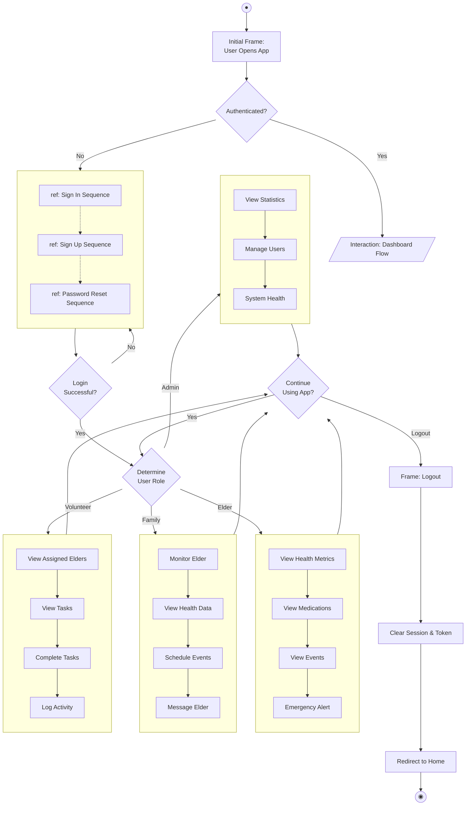

---

## 10. Use Case Descriptions

### 10.1 UC-01: User Sign Up

| Field | Description |
|-------|-------------|
| **Use Case ID** | UC-01 |
| **Use Case Name** | User Sign Up |
| **Actor** | Guest User |
| **Description** | New user creates an account in the system |
| **Preconditions** | User has access to the application |
| **Postconditions** | User account created, user logged in |
| **Main Flow** | 1. User navigates to Sign Up page<br/>2. User enters full name, email, password<br/>3. User selects role<br/>4. User clicks "Sign Up"<br/>5. System validates input<br/>6. System creates account<br/>7. System generates JWT token<br/>8. System redirects to dashboard |
| **Alternative Flow** | 5a. Email already exists → Show error<br/>5b. Invalid input → Show validation errors |
| **Exception Flow** | Server error → Show generic error message |

### 10.2 UC-02: User Sign In

| Field | Description |
|-------|-------------|
| **Use Case ID** | UC-02 |
| **Use Case Name** | User Sign In |
| **Actor** | Registered User |
| **Description** | User authenticates to access the system |
| **Preconditions** | User has an existing account |
| **Postconditions** | User authenticated, JWT token issued |
| **Main Flow** | 1. User navigates to Sign In page<br/>2. User enters email and password<br/>3. User selects role<br/>4. User clicks "Sign In"<br/>5. System validates credentials<br/>6. System generates JWT token<br/>7. System redirects based on role |
| **Alternative Flow** | 5a. Invalid credentials → Show error<br/>5b. Role mismatch → Show role error |
| **Exception Flow** | Server error → Show generic error message |

### 10.3 UC-03: Password Reset

| Field | Description |
|-------|-------------|
| **Use Case ID** | UC-03 |
| **Use Case Name** | Password Reset |
| **Actor** | Registered User |
| **Description** | User resets forgotten password |
| **Preconditions** | User has an existing account |
| **Postconditions** | Password updated successfully |
| **Main Flow** | 1. User clicks "Forgot Password"<br/>2. User enters email<br/>3. System sends reset token<br/>4. User receives email with link<br/>5. User clicks link<br/>6. User enters new password<br/>7. System updates password<br/>8. User redirected to login |
| **Alternative Flow** | 3a. Email not found → Show generic message (security) |
| **Exception Flow** | Token expired → Show error, retry |

### 10.4 UC-04: Family Member Monitors Elder

| Field | Description |
|-------|-------------|
| **Use Case ID** | UC-04 |
| **Use Case Name** | Monitor Elder Health |
| **Actor** | Family Member |
| **Description** | Family member views elder's health status |
| **Preconditions** | Family member logged in, linked to elder |
| **Postconditions** | Health data displayed |
| **Main Flow** | 1. Family member opens dashboard<br/>2. System fetches elder data<br/>3. Display health metrics<br/>4. Display medication status<br/>5. Display recent activities<br/>6. Display upcoming events |
| **Alternative Flow** | 3a. Critical health status → Show alert |
| **Exception Flow** | Elder not found → Show error |

### 10.5 UC-05: Volunteer Completes Task

| Field | Description |
|-------|-------------|
| **Use Case ID** | UC-05 |
| **Use Case Name** | Complete Care Task |
| **Actor** | Volunteer/Caregiver |
| **Description** | Volunteer marks a task as completed |
| **Preconditions** | Volunteer logged in, assigned to elder |
| **Postconditions** | Task marked complete, activity logged |
| **Main Flow** | 1. Volunteer views today's tasks<br/>2. Volunteer selects task<br/>3. Volunteer clicks "Complete"<br/>4. System updates task status<br/>5. System logs activity<br/>6. Display confirmation |
| **Alternative Flow** | 3a. Add notes before completing |
| **Exception Flow** | Task already completed → Show message |

---

## 11. Non-Functional Requirements

### 11.1 Performance Requirements

| Requirement | Specification |
|-------------|---------------|
| **Response Time** | API response < 500ms for 95% of requests |
| **Page Load** | Dashboard load < 3 seconds |
| **Concurrent Users** | Support 100+ concurrent users |
| **Database Queries** | Query execution < 100ms |

### 11.2 Security Requirements

| Requirement | Implementation |
|-------------|----------------|
| **Authentication** | JWT tokens with 24-hour expiry |
| **Password Storage** | bcrypt hashing with salt rounds = 10 |
| **Data Transmission** | HTTPS in production |
| **Input Validation** | Server-side validation for all inputs |
| **CORS** | Configured for allowed origins only |

### 11.3 Scalability Requirements

| Requirement | Approach |
|-------------|----------|
| **Horizontal Scaling** | Docker containers, load balancer ready |
| **Database Scaling** | MongoDB replica sets supported |
| **Stateless Backend** | JWT-based, no server sessions |

### 11.4 Availability Requirements

| Requirement | Target |
|-------------|--------|
| **Uptime** | 99.5% availability |
| **Recovery Time** | < 1 hour for critical failures |
| **Backup** | Daily database backups |

---

## 12. Security Design

### 12.1 Authentication Flow

```
┌─────────────────────────────────────────────────────────────────────────────┐
│                        Security Architecture                                 │
└─────────────────────────────────────────────────────────────────────────────┘

┌─────────────┐     ┌─────────────┐     ┌─────────────┐     ┌─────────────┐
│   Client    │     │   Server    │     │    Auth     │     │  Database   │
│  (Browser)  │     │  (Express)  │     │ Middleware  │     │  (MongoDB)  │
└──────┬──────┘     └──────┬──────┘     └──────┬──────┘     └──────┬──────┘
       │                   │                   │                   │
       │  1. Login Request │                   │                   │
       │  (email, pass)    │                   │                   │
       │──────────────────►│                   │                   │
       │                   │                   │                   │
       │                   │  2. Find User     │                   │
       │                   │───────────────────┼──────────────────►│
       │                   │                   │                   │
       │                   │  3. User Data     │                   │
       │                   │◄──────────────────┼───────────────────│
       │                   │                   │                   │
       │                   │  4. Verify Password (bcrypt)          │
       │                   │──────────────────►│                   │
       │                   │                   │                   │
       │                   │  5. Generate JWT  │                   │
       │                   │──────────────────►│                   │
       │                   │                   │                   │
       │                   │  6. JWT Token     │                   │
       │                   │◄──────────────────│                   │
       │                   │                   │                   │
       │  7. Response      │                   │                   │
       │  (token, user)    │                   │                   │
       │◄──────────────────│                   │                   │
       │                   │                   │                   │
       │  8. Store Token   │                   │                   │
       │  (localStorage)   │                   │                   │
       │                   │                   │                   │
       │  9. API Request   │                   │                   │
       │  (Bearer Token)   │                   │                   │
       │──────────────────►│                   │                   │
       │                   │                   │                   │
       │                   │  10. Verify Token │                   │
       │                   │──────────────────►│                   │
       │                   │                   │                   │
       │                   │  11. Token Valid  │                   │
       │                   │◄──────────────────│                   │
       │                   │                   │                   │
       │  12. Protected    │                   │                   │
       │      Response     │                   │                   │
       │◄──────────────────│                   │                   │
       │                   │                   │                   │
```

### 12.2 JWT Token Structure

```javascript
// Header
{
  "alg": "HS256",
  "typ": "JWT"
}

// Payload
{
  "userId": "507f1f77bcf86cd799439011",
  "role": "elder",
  "iat": 1704499200,  // Issued at
  "exp": 1704585600   // Expires (24 hours)
}

// Signature
HMACSHA256(
  base64UrlEncode(header) + "." +
  base64UrlEncode(payload),
  JWT_SECRET
)
```

### 12.3 Role-Based Access Control (RBAC)

| Role | Permissions |
|------|-------------|
| **Elder** | View own dashboard, health, medications, events |
| **Family Member** | View linked elder's data, create events, send messages |
| **Volunteer/Caregiver** | View assigned elders, complete tasks, log activities |
| **Admin** | Full system access, user management, system health |

---

## 13. Error Handling Design

### 13.1 Error Response Format

```javascript
// Standard Error Response
{
  "success": false,
  "message": "Human-readable error message",
  "error": {
    "code": "ERROR_CODE",
    "details": "Technical details (dev only)"
  }
}

// Example: Validation Error
{
  "success": false,
  "message": "Validation failed",
  "error": {
    "code": "VALIDATION_ERROR",
    "fields": {
      "email": "Invalid email format",
      "password": "Password must be at least 6 characters"
    }
  }
}
```

### 13.2 HTTP Status Codes

| Code | Meaning | Usage |
|------|---------|-------|
| 200 | OK | Successful GET, PUT |
| 201 | Created | Successful POST |
| 400 | Bad Request | Validation errors |
| 401 | Unauthorized | Invalid/missing token |
| 403 | Forbidden | Insufficient permissions |
| 404 | Not Found | Resource doesn't exist |
| 500 | Server Error | Internal errors |

### 13.3 Error Handling Middleware

```javascript
// Error Handler (backend/middleware/errorHandler.js)
const errorHandler = (err, req, res, next) => {
  console.error('Error:', err);
  
  // Mongoose validation error
  if (err.name === 'ValidationError') {
    return res.status(400).json({
      message: 'Validation failed',
      errors: Object.values(err.errors).map(e => e.message)
    });
  }
  
  // Mongoose duplicate key error
  if (err.code === 11000) {
    return res.status(400).json({
      message: 'Duplicate entry exists'
    });
  }
  
  // JWT errors
  if (err.name === 'JsonWebTokenError') {
    return res.status(401).json({
      message: 'Invalid token'
    });
  }
  
  if (err.name === 'TokenExpiredError') {
    return res.status(401).json({
      message: 'Token expired'
    });
  }
  
  // Default error
  res.status(500).json({
    message: 'Internal server error'
  });
};
```

---

## 14. Glossary

| Term | Definition |
|------|------------|
| **Actor** | An entity that interacts with the system |
| **API** | Application Programming Interface |
| **Authentication** | Process of verifying user identity |
| **Authorization** | Process of granting access permissions |
| **bcrypt** | Password hashing algorithm |
| **CORS** | Cross-Origin Resource Sharing |
| **CRUD** | Create, Read, Update, Delete operations |
| **Docker** | Container platform for deployment |
| **Express** | Node.js web application framework |
| **JWT** | JSON Web Token for authentication |
| **MongoDB** | NoSQL document database |
| **Mongoose** | MongoDB object modeling for Node.js |
| **MUI** | Material UI - React component library |
| **React** | JavaScript library for building UIs |
| **REST** | Representational State Transfer |
| **SPA** | Single Page Application |
| **UML** | Unified Modeling Language |

---

## Document Revision History

| Version | Date | Author | Description |
|---------|------|--------|-------------|
| 1.0 | January 6, 2026 | Development Team | Initial document creation |
| 1.1 | January 6, 2026 | Development Team | Added additional UML diagrams, use cases, NFRs, security design |

---

## Appendix A: Diagram Index

| Diagram Type | Section | Description |
|--------------|---------|-------------|
| **Structure Diagrams** | | |
| Class Diagram | 3.1 | System entities and relationships |
| Object Diagram | 3.2 | Runtime instance example |
| Package Diagram | 3.3 | Module organization |
| Deployment Diagram | 3.4 | Physical deployment |
| Profile Diagram | 3.5 | Stereotypes and constraints |
| Component Diagram | 9.1 | High-level components |
| Composite Structure | 9.2 | Internal component structure |
| **Behaviour Diagrams** | | |
| Use Case Diagram | 4.1 | Actor interactions |
| Activity Diagram (Auth) | 4.2 | Authentication flow |
| Activity Diagram (Reset) | 4.3 | Password reset flow |
| Activity Diagram (Monitor) | 4.4 | Family monitoring flow |
| State Machine (Elder) | 4.5 | Elder status states |
| State Machine (Medication) | 4.6 | Medication log states |
| State Machine (Event) | 4.7 | Event status states |
| **Interaction Diagrams** | | |
| Sequence (Sign In) | 5.1 | Login interaction |
| Sequence (Reset) | 5.2 | Password reset interaction |
| Sequence (Health) | 5.3 | Health viewing interaction |
| Sequence (Task) | 5.4 | Task completion interaction |
| Communication (Register) | 5.5 | Registration messages |
| Communication (Health) | 5.6 | Health recording messages |
| Timing Diagram | 9.3 | Authentication timing |
| Interaction Overview | 9.4 | High-level flow |

---

*End of Software Design Document*
