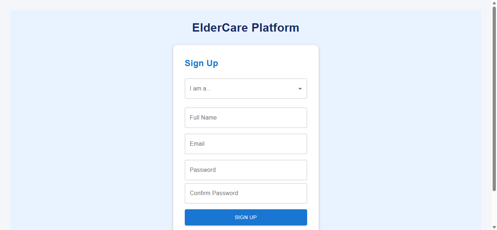
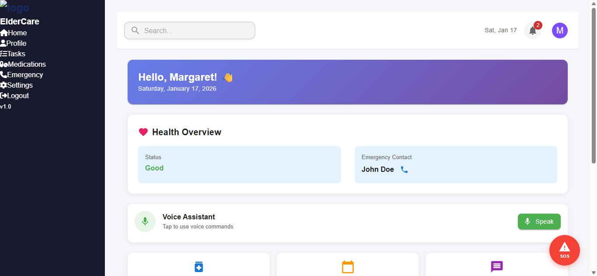
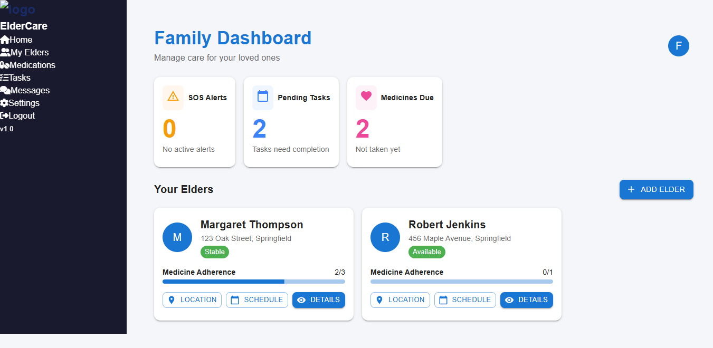

# ElderCare Connect - User Documentation

## Table of Contents
1. [Introduction](#introduction)
2. [Getting Started](#getting-started)
3. [User Registration](#user-registration)
4. [Sign In](#sign-in)
5. [Elder Dashboard](#elder-dashboard)
6. [Family Member Dashboard](#family-member-dashboard)
7. [Volunteer Dashboard](#volunteer-dashboard)
8. [Admin Dashboard](#admin-dashboard)
9. [Features Overview](#features-overview)

---

## Introduction

ElderCare Connect is a comprehensive platform designed to connect elderly individuals with their family members, volunteers, and healthcare support. The platform facilitates care coordination through features like medication tracking, task management, emergency SOS alerts, and real-time communication.

### Who Is This For?

- **Elders**: Daily task reminders, medicine alerts, SOS emergency button, simple chat
- **Family Members**: Monitor health, receive SOS notifications, direct communication, coordinate care
- **Volunteers/Caregivers**: Communicate with elders & families, track volunteer impact, assist in emergencies
- **Administrators**: Analytics & reporting dashboard, user management, monitor emergency responses

---

## Getting Started

### System Requirements
- Modern web browser (Chrome, Firefox, Safari, Edge)
- Internet connection
- JavaScript enabled

### Accessing the Platform
1. Open your web browser
2. Navigate to the ElderCare Connect URL
3. You will be greeted with the homepage

---

## User Registration

To create a new account:

1. Click **"Get Started"** on the homepage or **"Sign In"** → **"Sign Up"**
2. Select your role:
   - Elder
   - Volunteer / Caregiver
   - Family Member
   - Administrator
3. Fill in your details:
   - Full Name
   - Email Address
   - Password (must meet strength requirements)
   - Confirm Password
4. Click **"Sign Up"**

### Password Requirements

Your password must include:
- ✓ At least 8 characters
- ✓ One uppercase letter (A-Z)
- ✓ One lowercase letter (a-z)
- ✓ One number (0-9)
- ✓ One special character (!@#$%^&*)

The password strength indicator will show:
- **Weak** - Does not meet minimum requirements
- **Fair** - Meets some requirements
- **Good** - Meets most requirements
- **Strong** - Meets all requirements
- **Very Strong** - Exceeds requirements

---

## Sign In

1. Click **"Sign In"** on the homepage
2. Enter your registered email address
3. Enter your password
4. Click **"Sign In"**

### Forgot Password?
1. Click **"Forgot Password?"** on the Sign In page
2. Enter your registered email
3. Check your email for reset instructions
4. Follow the link to create a new password

---

## Elder Dashboard

The Elder Dashboard is designed for easy navigation with large buttons and clear information.

### Sidebar Navigation
- **Home** - Main dashboard view
- **Profile** - View and edit your profile
- **Tasks** - View pending tasks and reminders
- **Medications** - Manage your medication schedule
- **Emergency** - Access emergency contacts and SOS
- **Settings** - Customize your preferences
- **Logout** - Sign out of the platform

### Dashboard Features

#### Health Overview
- View your current health status
- See emergency contact information
- Quick access to call emergency contact

#### Voice Assistant
- Tap **"Speak"** button to use voice commands
- Get help hands-free

#### Quick Stats
- **Medicines Taken**: Track daily medication progress
- **Pending Tasks**: View incomplete tasks
- **New Messages**: Check unread messages

#### Today's Medicines
- See all medications for the day
- Mark medicines as taken
- View medication details

#### SOS Button
- Large red SOS button always visible
- One-tap to send emergency alert to all contacts
- Automatically shares your location

---

## Family Member Dashboard

The Family Dashboard allows you to monitor and coordinate care for your elderly family members.

### Sidebar Navigation
- **Home** - Main dashboard view
- **My Elders** - View and manage linked elders
- **Medications** - Track medication schedules
- **Tasks** - Manage care tasks
- **Messages** - Communicate with elders and caregivers
- **Settings** - Customize notifications and preferences
- **Logout** - Sign out

### Dashboard Features

#### Overview Cards
- **SOS Alerts**: Active emergency alerts
- **Pending Tasks**: Tasks needing attention
- **Medicines Due**: Medications not yet taken

#### Your Elders Section
- View all linked elderly family members
- See their status (Stable, Needs Help, Available)
- Track medication adherence with progress bar
- Quick actions:
  - **Location**: View current location
  - **Schedule**: See appointments and reminders
  - **Details**: View full profile and health info

#### Adding a New Elder
1. Click **"+ Add Elder"** button
2. Enter elder's name, address, and phone
3. Click **"Add"** to link the elder to your account

---

## Volunteer Dashboard

The Volunteer Dashboard helps caregivers manage their assignments and track their impact.

### Sidebar Navigation
- **Dashboard** - Main overview
- **Assigned Elders** - View assigned elderly individuals
- **Schedule** - View your schedule and appointments
- **Tasks** - Manage assigned tasks
- **Messages** - Communicate with elders and families
- **Settings** - Update availability and preferences
- **Logout** - Sign out

### Dashboard Features

#### Stats Overview
- **People Helped**: Total number of elders assisted
- **Active Requests**: Current help requests
- **Your Rating**: Average rating from families
- **Avg Response**: Average response time

#### Nearby Elders
- View elders in your area needing help
- See their status and age
- Quick actions:
  - **Call**: Direct phone call
  - **Message**: Send a message
  - **Offer Help**: Volunteer to assist

#### Recent Activity
- View recently completed assistance
- See ratings and feedback

---

## Admin Dashboard

The Admin Dashboard provides system-wide management and analytics.

### Sidebar Navigation
- **Dashboard** - System overview
- **Users** - Manage all platform users
- **Volunteers** - Manage volunteer applications and assignments
- **SOS Alerts** - Monitor emergency alerts
- **Reports** - Generate analytics reports
- **Settings** - System configuration
- **Logout** - Sign out

### Dashboard Features

#### Key Metrics
- **Total Elders**: Number of registered elders
- **Active Volunteers**: Number of active volunteers
- **Active SOS Alerts**: Current emergency situations
- **Avg Response Time**: System-wide response time

#### SOS Response Trends
- Weekly chart showing alerts and resolutions
- Track system performance over time

#### User Distribution
- Pie chart showing user breakdown by role
- Monitor platform growth

#### Pending Volunteer Approvals
- Review new volunteer applications
- View applicant details
- Approve or reject applications

#### Recent SOS Alerts
- View latest emergency responses
- Track resolution status
- Monitor response times

---

## Features Overview

### Emergency SOS System
- One-tap emergency button
- Automatic location sharing
- Instant notification to all contacts
- Real-time tracking for responders

### Medication Management
- Set medication schedules
- Receive reminders
- Track adherence
- Family members can monitor

### Task Management
- Create and assign tasks
- Set due dates and priorities
- Track completion status
- Get reminders

### Communication
- In-app messaging
- Video calls (coming soon)
- Group chats for care coordination
- Message history

### Location Services
- Real-time elder location
- Geofencing alerts
- Route tracking
- Privacy controls

### Voice Assistant
- Hands-free navigation
- Voice commands for common actions
- Accessibility support

---

## Support

If you need help or have questions:

- **Email**: support@eldercareconnect.com
- **Phone**: 1-800-ELDER-CARE
- **In-app**: Use the Help section in Settings

---

## Version History

| Version | Date | Changes |
|---------|------|---------|
| 1.0 | January 2026 | Initial release |

---

© 2026 ElderCare Connect. All rights reserved.
